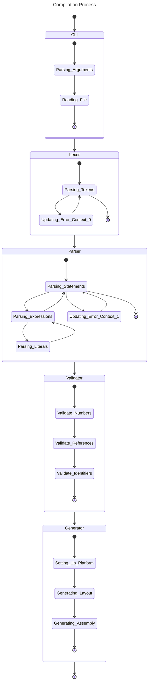

# Preface
In this Readme [mermaid](https://mermaid.js.org) is used! To render those graphs download the corresponding plugin of you IDE or visit the official side and past in the code.

# Compilation Process
This briefly explains what happens during the compilation process mentioning every major stages. 
## Word Version
So there are five major stages: CLI, Lexer, Parser, Validator, Generator

### CLI
The CLI is responsible for getting the content of the script you want to compile. It also parses the arguments for the further process.

### Lexer
The Lexer gets the content of the script in form of a string and produces a series of tokens that is contained in that file. If there are errors in the file it also provides context where the error occurred for accurate error messages.

### Parser
The Parser looks at the tokens provided by the lexer and processes them into statements. These statements might contain expressions which also contain literals. During all these steps the parser maintains an error context to provide meaningful error messages.

### Validator
The Validator is responsible for checking if the numbers inside the script are in the valid range. It also checks if the used addresses are in the valid range and if all the used identifiers are declared before usage.

### Generator
The Generator selects the compilation platform provided by the arguments. It later generates the default layout needed for that certain platform. The last step is to convert the statements into the corresponding assembly operations.

## Graph Version


# Syntax

## Variables

```
// Push the number 123 on top of the stack
push 123;
// The current stack address is assigned to the variable 'a'
assign a;
// Puts the number 30 onto the stack. And then pops the number ontop of the stack into the address of the variable 'a'
push 30;
pop a;
// Put the number 20 into the address of the variable 'a' (Shorthand for the one above)
put a 0x10100; // Is equal to 0x00010100 == 20
// Copy the value at the address 'a' intop of the stack
load a;
// Remove the number at the address of 'a' from the stack
drop a;
```

## Basic Operations
```
// Operations consume the values on the stack

// Adds the two numbers ontop of the stack and puts the result back on the stack
add; // Needs two values
// Subtracts the two numbers ontop of the stack and puts the result back on the stack
sub; // Needs two values
// Multiplies the two numbers ontop of the stack and puts the result back on the stack
mul; // Needs two values
// Divides the two numbers ontop of the stack and puts the result back on the stack
div; // Needs two values
// Gets the remainder of the divition of two numbers ontop of the stack and puts the result back on the stack
mod; // Needs two values
// Increases the number ontop of the stack and puts it back on it
inc; // Needs one value
// Decreases the number ontop of the stack and puts it back on it
dec; // Needs one value

// Ands two numbers from the stack bit by bit and puts it back on it
and; // Needs two values
// Ors two number from the stack bit by bit and puts it back on it
or; // Needs two values
// Xors two numbers from the stack bit by bit and puts it back on it
xor: // Needs two values

// Checks if the values are equals and puts a 0 or 1 on the stack
eq; // Needs two values
// Checks if the values are not equals and puts a 0 or 1 on the stack
neq; // Needs two values
// Checks if the first value is less than the second value and puts a 0 or 1 on the stack
lt; // Needs two values
// Checks if the first value is equal or less than the second value and puts a 0 or 1 on the stack
elt; // Needs two values
// Checks if the first value is greater than the second value and puts a 0 or 1 on the stack
gt; // Needs two values
// Checks if the first value is equal or greater than the second value and puts a 0 or 1 on the stack
egt; // Needs two values

// To invert a boolean you can use following operations
// Pushes the boolean true onto the stack
push 0x1;
// Pushes the mask to invert onto the stack
push 0x1;
// Xors the values changing the last bit to a 1 if it was 0 and to 0 if it was a 1
xor;

// Or use the 'not' operation doing the same thing
not; // Needs one value
```

## Basic Statements
```
// If-Statements pop the value ontop the stack and check if the last bit is 0 (false) or 1
 (true)
push 12;
assign a;

// Evaluates the expressions inside the () and performs the check on the value ontop of the stack
if (load a; push 6; lt)
    put a 6;
else if (load a; push 8; lt)
    put a 8;
else
    put a 10;
end

push 0;
assign i;

while (load i; push 6; lt)
    load i;
    inc;
    pop i;
end

```

## Procedures/Function

```
// Procedures do something but dont return anything. A procedure is scoped which means that the stack is reseted to the previous address.
proc b(c,d)
    push 10;
end

// Functions do something and return a number which is stored ontop of the stack
func b(c,d)
    load c;
    load d;
    add;
    return;
end

// Even though a procedure/function is scoped you can still mess up
proc b()
    // This would access numbers that are outside the scope of the function
    pop;
    pop;
    pop;
end

// calling a procedure or function with arguments
push 10; // c
push 20; // b
call b;
```

## Build-In-Procedures
```
// Ascii code for 'A'
push 65;
// interprets the number on the stack as a char and prints it to stdout
call print_char;

// The amount of digits to print
push 4;
// The number to print
push 1234;
// Prints the last n digits of the provided number
call print_number;

// The amount of chars to print
push 12;
// The chars to print. Translates into pushes with the ascii codes of the seperate chars.
push "Hello World!"
call print_string;

// Exits the program with the status code of the number ontop of the stack
exit
```

## Example - [Fibonacci](https://de.wikipedia.org/wiki/Fibonacci-Folge)
```
func fibonacci(n)
    // Store the last two numbers. Starts with 1 1
    push 1
    assign f1
    push 1
    assign f2
    
    // The base index is 2 anything <= 2 will return 1
    push 2
    assign i
    
    while (load i; load n; lt)
        // Calculate the next number
        load f1
        load f2
        add
        
        // Shift the current number at the front to the back
        load f2
        pop f1
        
        // Store the new number in the front
        pop f2
    
        // Increase the current index by 1
        load i
        inc
        pop i
    end
    
    // return the calculated fibonacci number
    load f2
    return
end

// The amount of digits to later print
push 4

// Calculate the 10th fibonacci number (55)
push 10
call fibonacci

// Print out the result (0055)
call print_number

```